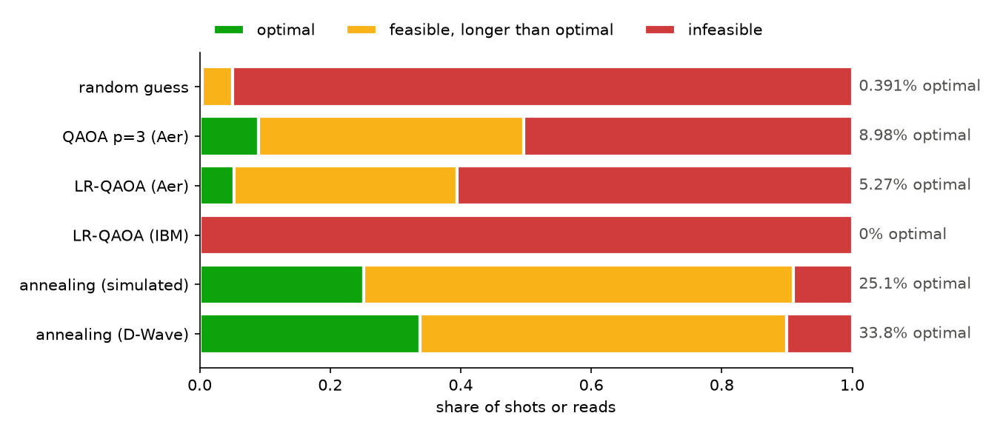

# Quantum applications

Worked examples of optimisation problems solved with quantum methods, next to the classical methods they have to beat. They're written for technical readers who are exploring quantum computing: short, plain Python, the maths explained along the way, and results from IBM and D-Wave hardware as well as simulators.



*Job shop scheduling on a 21-qubit example: the share of each method's shots or reads that came out optimal, feasible but longer, or infeasible. Random guessing is the baseline.*

## Examples

| folder | problem | methods | status |
|---|---|---|---|
| [`job-shop-scheduling`](job-shop-scheduling) | schedule tasks on machines to finish as soon as possible | greedy, brute force, Gurobi, QAOA and LR-QAOA (simulated and IBM), annealing (simulated and D-Wave) | done |
| [`sudoku`](sudoku) | fill in a sudoku grid | simulated quantum annealing, exact statevector evolution, D-Wave | being moved in |
| unit commitment | decide which power stations to run | MAX-LINSAT with decoded quantum interferometry (DQI) | planned |
| finance | a problem still to be chosen | quantum-accelerated Monte Carlo (QCMC) | planned |

## What we've found so far

- At the sizes that can be simulated or brute-forced, a classical MILP solver (Gurobi) proves every job shop optimum in under a millisecond. Nothing here shows a quantum advantage, and the examples don't claim one.
- Noiseless QAOA and simulated annealing beat random guessing comfortably.
- On hardware, D-Wave keeps up with the simulated annealer on small problems and falls behind from about 7 tasks (26 to 69 variables). IBM's LR-QAOA circuits, at around 2,000 two-qubit gates, do worse than random guessing.

## Setup

You need [uv](https://docs.astral.sh/uv/) and Python 3.12 or later.

```
uv sync
uv run pytest
```

- Gurobi: `gurobipy` installs with a size-limited licence, which is enough for these examples.
- D-Wave (optional): a [Leap](https://cloud.dwavesys.com/leap/) account, then `uv run dwave setup` to save your API token.
- IBM Quantum (optional): an [IBM Quantum Platform](https://quantum.cloud.ibm.com/) account, then save your API key once with `QiskitRuntimeService.save_account(token=..., instance=...)`.

Without the optional accounts, everything runs on local simulators; each example's README says what needs an account.

## Plans

The unit commitment and finance examples are next. After that, the plan is to profile the Python and rewrite the slowest part in Rust with PyO3. Working notes are in [TODO.md](TODO.md).
