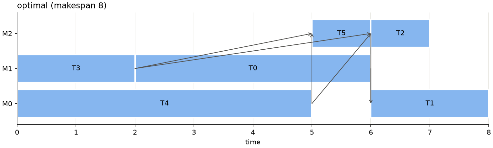
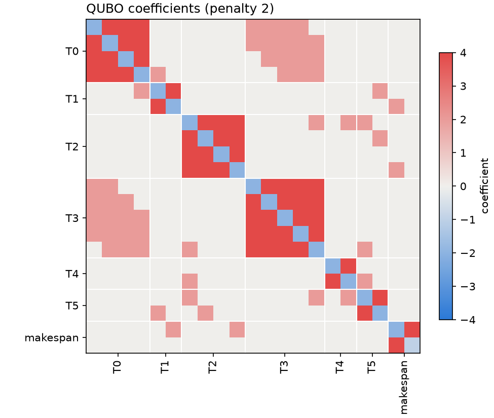
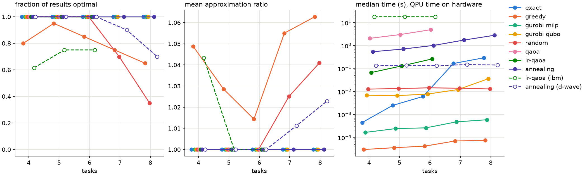

# Job shop scheduling

We have a set of tasks. Each needs one machine for a fixed time, and some can't start until others have finished. We want the schedule that finishes soonest, with the smallest makespan.

The notebook writes this as a QUBO and solves it classically, with QAOA (simulated, and on IBM hardware) and with quantum annealing (simulated, and on D-Wave), then benchmarks the methods on random problems.



## Running it

The modules import each other by name, so run everything from this folder:

```
cd job-shop-scheduling
uv run jupyter lab job_shop_scheduling.ipynb
```

The IBM and D-Wave cells need accounts (see the [top-level README](../README.md)). Without them, skip those two cells and set `use_hardware = False` in the benchmark.

Or use the modules directly:

```python
from classical import solve_gurobi, solve_random
from problem import Problem
from qaoa import solve_lr_qaoa
from qiskit_aer import AerSimulator

problem = Problem.random(num_tasks=6, num_machines=3, min_parents=2, max_parents=2, max_duration=5, seed=257)
problem.optimum = solve_gurobi(problem).makespan  # the other solvers are scored against it
solve_lr_qaoa(problem, AerSimulator(), seed=0).describe()
solve_random(problem, seed=0).describe()
```

## How it works

- Each task's start time is limited to a window: no earlier than its ancestors allow, and no later than the greedy schedule's makespan (the horizon) minus the work that has to follow it. This removes most start times before any solver runs. It also means the QUBO only holds schedules at least as good as the greedy one.
- The QUBO has one binary variable per task and allowed start time, plus a zero-duration makespan task that follows every childless task. The objective is the makespan task's start time, measured from its earliest possible start L, so a penalty of horizon - L + 1 is enough for any broken constraint.
- QAOA starts each task in an equal superposition of its start times, and uses an XY mixer that keeps exactly one of them set, so its circuits don't need the one-hot penalty. LR-QAOA replaces the optimiser with fixed linear ramps of the angles.
- Annealing samples the full QUBO, minor-embedded onto the D-Wave QPU.



## Results

On the notebook's example problem (21 qubits), the noiseless samplers all beat random guessing comfortably, and D-Wave does best. The IBM device does worse than guessing: only one of its 4,096 shots was a valid schedule.


The benchmark runs 20 random problems at each size, from 4 tasks up to the size where the brute-force solver takes about a second (8 tasks). The gate-based solvers only get problems of up to 20 qubits.



- Gurobi's MILP proves every optimum in under a millisecond, so there's no quantum advantage at these sizes.
- With 4,096 guesses per problem, random guessing finds the optimum every time up to 6 tasks. The annealers only pull ahead of it at 7 and 8 tasks.
- D-Wave finds the optimum on 90% of problems at 7 tasks and 70% at 8. IBM (`ibm_miami`) manages 62 to 75% at 4 to 6 tasks, below random guessing.

## Files

| file | contents |
|---|---|
| `job_shop_scheduling.ipynb` | the walkthrough and the benchmark |
| `problem.py` | the problem: random generation, bounds and windows, the greedy schedule, feasibility, Gantt charts |
| `formulation.py` | the QUBO, its Ising form, decoding samples, and the QUBO heatmap |
| `classical.py` | greedy, brute force, Gurobi (MILP or QUBO) and random guessing |
| `qaoa.py` | QAOA and LR-QAOA with Qiskit, and circuit resource estimates |
| `annealing.py` | annealing with any dimod sampler, D-Wave included |
| `results.py` | the result every solver returns, and the outcome chart |
| `test_job_shop.py` | tests of the QUBO's ground states, Qiskit's bit order and feasibility checks |
| `benchmark_instances.json` | classic instances from JobShopLib, for `Problem.load("ft06")` |
| `benchmark_results.json` | the benchmark's raw results |
| `figures/` | the figures above, written by the notebook |

## Limits

- Only small problems: the brute-force solver sets the size limit, and statevector simulation stops at about 20 qubits.
- TTS in the code is the wall-clock time of a solve, and the benchmark plots QPU time for hardware. In the literature, time-to-solution usually means the time per run multiplied by reps99.
- Simulator and classical times are wall-clock times on a laptop, and varied by about 3x between runs.

## References

- Google OR-Tools, [the job shop problem](https://developers.google.com/optimization/scheduling/job_shop)
- Schmid et al., [arXiv:2401.16381](https://arxiv.org/abs/2401.16381)
- LR-QAOA's linear ramps, [arXiv:2405.09169](https://arxiv.org/abs/2405.09169)
